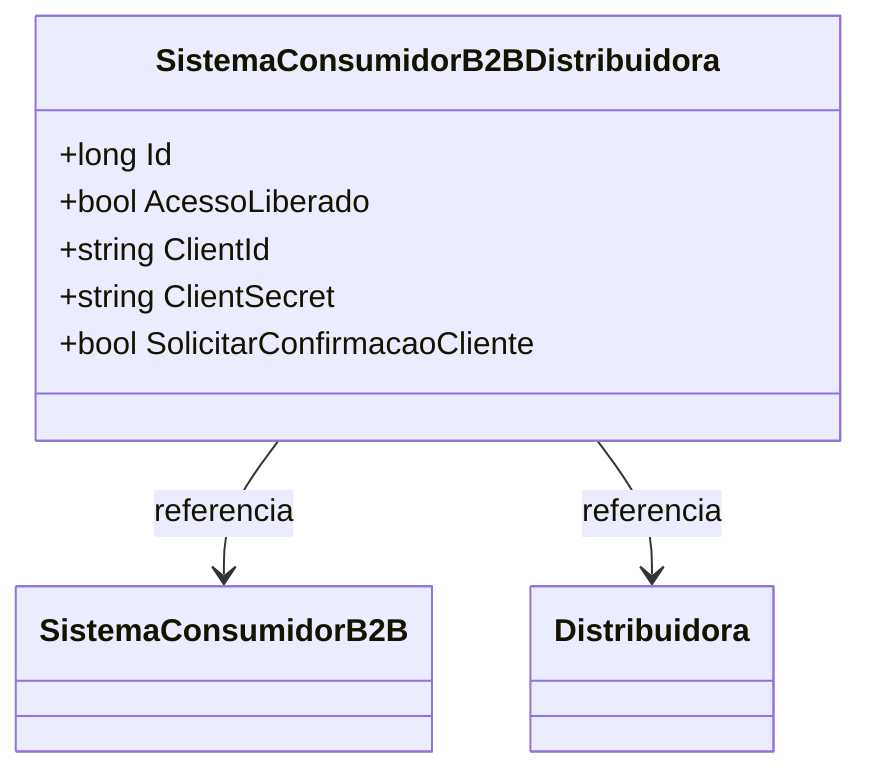

# SistemaConsumidorB2BDistribuidora
**Namespace**: IsthmusWinthor.Dominio.Entidades  
**Nome do Arquivo**: SistemaConsumidorB2BDistribuidora.cs  

## Visão Geral e Responsabilidade
A classe `SistemaConsumidorB2BDistribuidora` representa uma entidade do domínio que vincula um sistema consumidor do tipo B2B a uma distribuidora. Ela é responsável por regular o acesso entre o sistema consumidor e a distribuidora, garantindo a integridade do acesso e configurando a autenticação necessária. Este modelo aborda um aspecto fundamental na arquitetura corporativa, onde as credenciais de acesso e a autorização para utilização dos sistemas são críticas para garantir que os processos de negócios fluam de maneira controlada e segura.

## Métodos de Negócio
Esta classe não possui métodos de lógica de negócios complexos, mas é importante ressaltar a validação dos dados e a lógica de autorização através de suas propriedades.

## Propriedades Calculadas e de Validação
- `AcessoLiberado`: Esta propriedade determina se o acesso ao sistema consumidor está liberado. Ela garante que apenas os sistemas consumidores permitidos possam interagir com a distribuidora conforme as regras de negócio definidas.
- `SolicitarConfirmacaoCliente`: Quando ativada, esta propriedade exige que o cliente confirme a criação da credencial para o sistema consumidor, assegurando uma camada adicional de segurança no fluxo de autenticação.

## Navigations Property
- `[SistemaConsumidorB2B](SistemaConsumidorB2B.md)`: Representa a associação com o sistema consumidor B2B.
- `[Distribuidora](Distribuidora.md)`: Representa a associação com a distribuidora que está utilizando o sistema.

## Tipos Auxiliares e Dependências
- Não há enums ou tipos auxiliares diretamente utilizados na classe.

## Diagrama de Relacionamentos

Esta documentação proporciona uma visão clara das regras de negócio, integridade de dados e relacionamento da classe `SistemaConsumidorB2BDistribuidora`, assegurando que desenvolvedores e arquitetos possam compreender rapidamente seus objetivos dentro do sistema.
