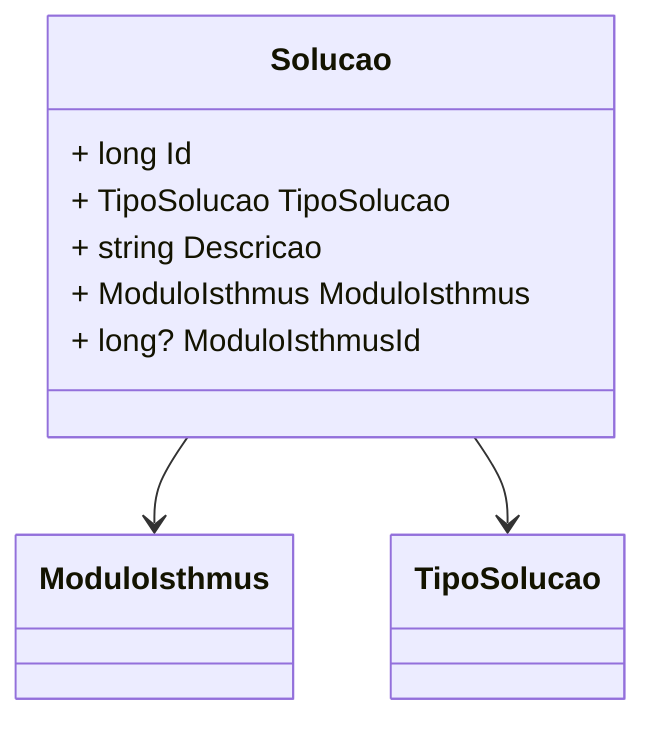

# Solucao

**Namespace**: IsthmusWinthor.Dominio.Entidades  
**Nome do Arquivo**: Solucao.cs

## Visão Geral e Responsabilidade
A classe `Solucao` representa os produtos disponíveis na plataforma Isthmus. Seu papel principal é encapsular as informações relacionadas a diferentes soluções oferecidas, que incluem um tipo de solução, descrição e a associação com módulos específicos. Com isso, a classe garante que as soluções sejam0 corretamente categorizadas e referenciadas dentro do contexto da aplicação, facilitando a integração dos produtos ao restante do sistema.

## Métodos de Negócio
A classe `Solucao` não possui métodos de negócio com lógica complexa que sejam relevantes para este documento. 

## Propriedades Calculadas e de Validação
A classe não possui propriedades que contenham cálculos ou validações específicas nos seus métodos `get` ou `set`.

## Navigations Property
- [ModuloIsthmus](ModuloIsthmus.md): Esta propriedade é uma referência a um módulo específico da plataforma, representando uma relação entre a solução e o módulo a que pertence.

## Tipos Auxiliares e Dependências
- [TipoSolucao](TipoSolucao.md): Esta é uma enumeração que define os tipos possíveis de soluções, garantindo que somente tipos predefinidos possam ser usados ao associar uma solução.

## Diagrama de Relacionamentos

---
Gerada em 29/12/2025 20:50:12
