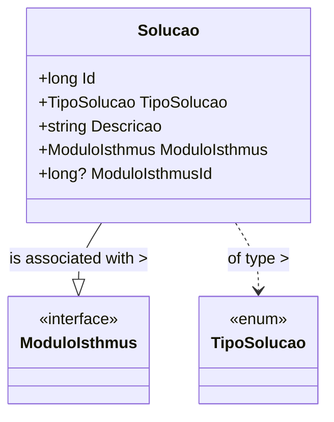

# Solucao

**Namespace**: IsthmusWinthor.Dominio.Entidades  
**Nome do Arquivo**: Solucao.cs  

## Visão Geral e Responsabilidade
A classe `Solucao` representa os produtos que a empresa Isthmus possui. É uma entidade fundamental no domínio, que permite a modelagem e a gestão de diferentes soluções disponíveis para os clientes. A principal responsabilidade dessa classe é garantir a integridade dos dados das soluções, associando cada produto a um tipo específico (`TipoSolucao`) e a um módulo (`ModuloIsthmus`), o que reflete a estrutura organizacional das ofertas da empresa.

## Métodos de Negócio
*Nota: A classe `Solucao` não possui métodos com lógica de negócio complexa. Portanto, não há métodos detalhados a serem apresentados.*

## Propriedades Calculadas e de Validação
- **Id**: Representa a identificação única da solução.
- **TipoSolucao**: Define a categoria ou tipo da solução, garantindo que apenas tipos válidos sejam atribuídos.
- **Descricao**: Fornece uma descrição textual da solução, deve ser validada para não estar vazia.
- **ModuloIsthmus**: Propriedade de navegação que referencia o módulo ao qual a solução pertence, garantindo que exista uma relação válida.
- **ModuloIsthmusId**: Identificador opcional do módulo, que deve estar associado corretamente à propriedade `ModuloIsthmus`.

## Navigations Property
- [ModuloIsthmus](ModuloIsthmus.md): Representa o módulo específico associado a esta solução.

## Tipos Auxiliares e Dependências
- [TipoSolucao](TipoSolucao.md): Enum que define os diferentes tipos de soluções disponíveis.

## Diagrama de Relacionamentos

Esta documentação fornece uma visão clara das regras de negócio e da estrutura da classe `Solucao`, facilitando a compreensão e manutenção do sistema.
