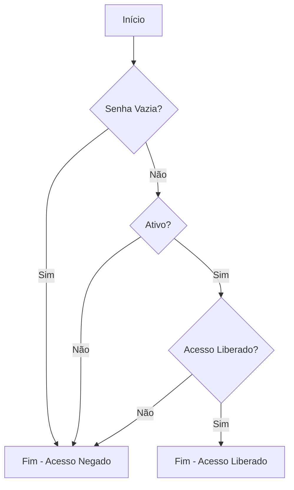
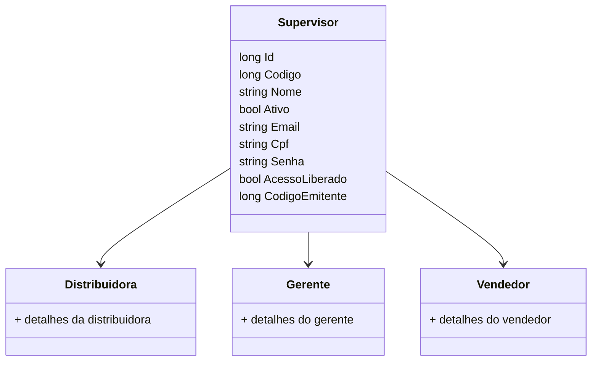

# Supervisor
**Namespace**: IsthmusWinthor.Dominio.Entidades  
**Nome do Arquivo**: Supervisor.cs  

## Visão Geral e Responsabilidade
A classe `Supervisor` representa um agente de supervisão em um sistema de gerenciamento. Este modelo de domínio encapsula as informações e comportamentos relacionados a um supervisor, permitindo que o sistema controle a supervisão de vendedores em relação a uma distribuidora específica. A classe abrange validações associadas ao acesso do supervisor e suas ligações a outras entidades, como `Distribuidora` e `Gerente`, ajudando a resolver problemas de integridade de dados relacionados ao papel do supervisor nas operações de vendas.

## Métodos de Negócio

### Título: PodeAcessarB2B (Public)
- **Objetivo**: Garante que somente supervisores que têm uma senha definida, estão ativos e têm acesso liberado possam acessar uma plataforma B2B.
- **Comportamento**: 
  1. Verifica se a propriedade `Senha` não está vazia ou nula.
  2. Confirma se a propriedade `Ativo` é verdadeira.
  3. Valida se `AcessoLiberado` está definido como verdadeiro.
- **Retorno**: Retorna um valor booleano (`true` ou `false`), indicando se o supervisor pode acessar a plataforma B2B.

## Propriedades Calculadas e de Validação
- **PodeAcessarB2B**: Esta propriedade avalia três condições:
  1. `Senha` não é nula ou vazia.
  2. `Ativo` deve ser verdadeiro.
  3. `AcessoLiberado` deve ser verdadeiro.
  Este cálculo assegura que apenas supervisores com requisitos de acesso específicos possam interagir com a plataforma B2B.

## Navigations Property
- [Distribuidora](Distribuidora.md)
- [Gerente](Gerente.md)
- [Vendedor](Vendedor.md)

## Tipos Auxiliares e Dependências
- Enumeradores ou classes utilizadas não estão explicitamente presentes no código fornecido.

## Diagrama de Relacionamentos

Esta documentação fornece uma visão clara e organizada sobre a classe `Supervisor`, detalhando suas responsabilidades, regras de negócio e relacionamentos no contexto do domínio em que se insere.
---
Gerada em 29/12/2025 20:50:28
