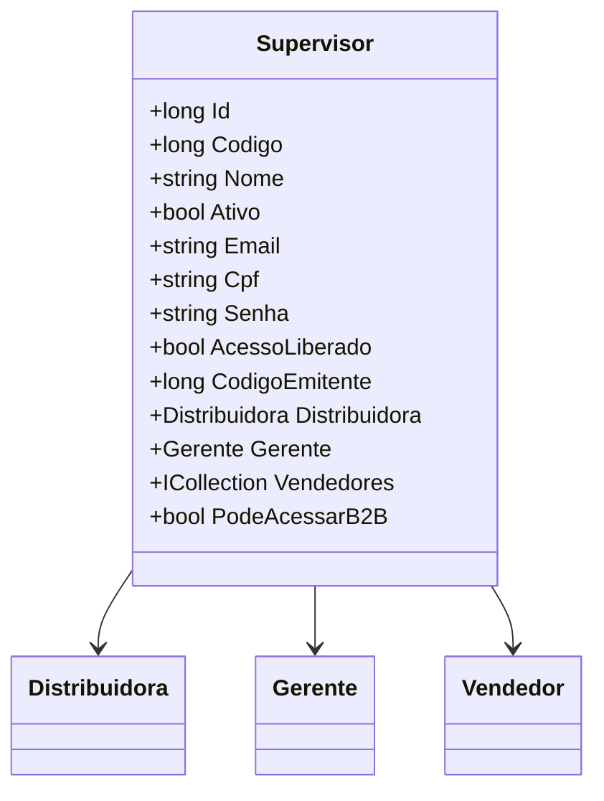

# Supervisor
**Namespace**: IsthmusWinthor.Dominio.Entidades  
**Nome do Arquivo**: Supervisor.cs  

## Visão Geral e Responsabilidade
A classe `Supervisor` é um modelo de domínio que representa um supervisor dentro de um sistema de gestão de vendas. Seu papel é gerenciar as informações e o estado de supervisores que podem ter acesso a um sistema de B2B (Business to Business). A classe garante que apenas supervisores ativos e com acesso liberado possam interagir com funções críticas do sistema, assegurando a integridade e segurança dos dados nas operações de venda.

## Métodos de Negócio
### Título: PodeAcessarB2B (Propriedade Calculada)
- **Objetivo**: Garante que o supervisor possa acessar a funcionalidade B2B somente se a senha está definida, o supervisor está ativo e o acesso está liberado.
- **Comportamento**: 
    1. Verifica se a propriedade `Senha` não está vazia.
    2. Confirma se o supervisor está `Ativo`.
    3. Assegura que `AcessoLiberado` é verdadeiro.
- **Retorno**: Retorna um valor booleano que indica se o supervisor tem permissão para acessar a plataforma B2B.

## Propriedades Calculadas e de Validação
### PodeAcessarB2B
- **Regra**: A propriedade permite o acesso ao B2B apenas se todas as condições de estado (`Senha`, `Ativo`, `AcessoLiberado`) estiverem satisfeitas.

## Navigations Property
- `[Distribuidora](Distribuidora.md)`: Representa a distribuidora associada ao supervisor.
- `[Gerente](Gerente.md)`: Representa o gerente ao qual o supervisor está vinculado.
- `[Vendedor](Vendedor.md)`: Coleção de vendedores supervisionados, representando a relação entre supervisores e a equipe de vendas.

## Tipos Auxiliares e Dependências
- **Enums**: Nenhum enumerador é utilizado diretamente nesta classe.
- **Classes Estáticas/Helpers**: Nenhuma classe auxiliar é utilizada diretamente nesta classe.

## Diagrama de Relacionamentos

