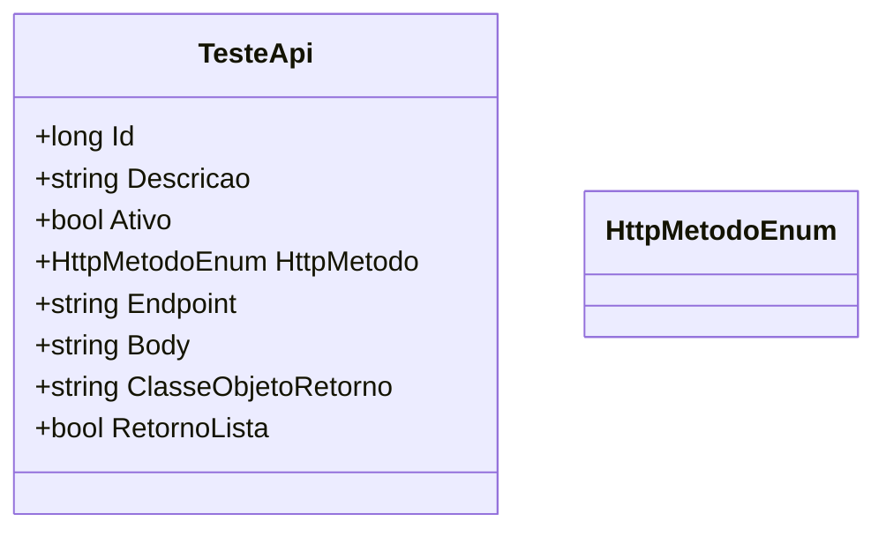

# TesteApi
**Namespace**: IsthmusWinthor.Dominio.Entidades  
**Nome do Arquivo**: TesteApi.cs  

## Visão Geral e Responsabilidade
A classe `TesteApi` representa uma entidade que encapsula detalhes de testes de integração com APIs. Seu objetivo principal é permitir a configuração e execução de testes automatizados em serviços RESTful. A classe armazena informações essenciais como método HTTP, endpoint, e o corpo da requisição, além de indicar se o retorno esperado é uma lista ou um objeto único. Essa estrutura é fundamental para garantir a flexibilidade e robustez nos testes de integração.

## Métodos de Negócio
Neste caso, `TesteApi` não possui métodos de negócio com lógica complexa a serem documentados. A classe atua mais como um contêiner de dados.

## Propriedades Calculadas e de Validação
A classe não contém propriedades com lógica de cálculo ou validação no `get`/`set`.

## Navigation Property
A classe `TesteApi` não possui propriedades que sejam classes complexas do domínio.

## Tipos Auxiliares e Dependências
* Enumeradores:
  * `[HttpMetodoEnum](HttpMetodoEnum.md)`

## Diagrama de Relacionamentos

