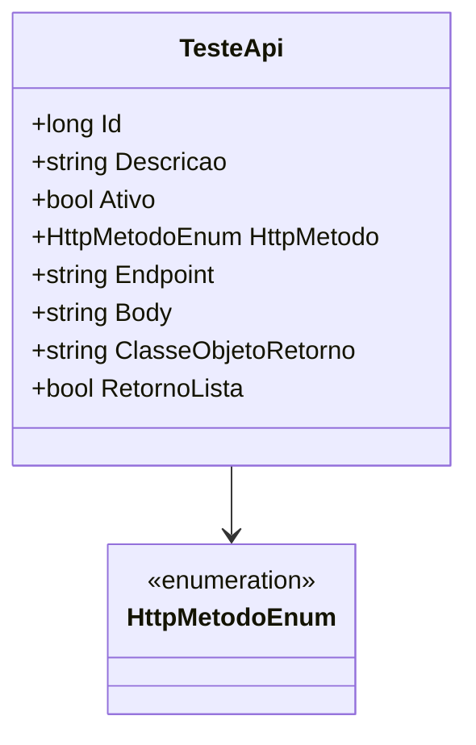

# TesteApi

**Namespace**: IsthmusWinthor.Dominio.Entidades  
**Nome do Arquivo**: TesteApi.cs  

## Visão Geral e Responsabilidade
A classe `TesteApi` representa uma entidade que é utilizada para definir as características de um teste de API no contexto do domínio da aplicação. A classe encapsula informações fundamentais que ajudam na execução de chamadas de APIs, possibilitando configurar parâmetros como o método HTTP, endpoint, corpo da solicitação e características do retorno esperado. Através dessa estrutura, a classe resolve a necessidade de padronização e documentação dos testes de inteiração com APIs externas, garantindo a integridade dos dados envolvidos e a clareza na execução dos mesmos.

## Métodos de Negócio
**Nota:** A classe atual não contém métodos de negócio com lógica complexa.

## Propriedades Calculadas e de Validação
- Não há propriedades com lógica de validação ou cálculo.

## Navigations Property
- Não há propriedades de navegação complexas.

## Tipos Auxiliares e Dependências
- **Enumeradores:**
    - [HttpMetodoEnum](HttpMetodoEnum.md)

## Diagrama de Relacionamentos

Esta documentação sintetiza as principais informações relacionadas à classe `TesteApi` e sua função dentro do sistema, assegurando que as regras de negócio sejam respeitadas e que a integridade dos dados seja mantida.
---
Gerada em 29/12/2025 20:50:40
