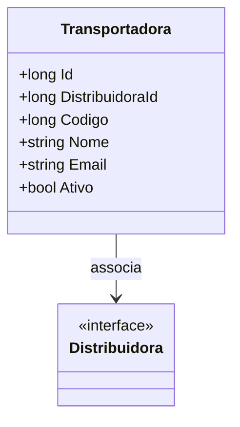

# Transportadora
**Namespace**: IsthmusWinthor.Dominio.Entidades  
**Nome do Arquivo**: Transportadora.cs  

## Visão Geral e Responsabilidade
A classe `Transportadora` representa uma entidade no domínio responsável por gerenciar informações sobre transportadoras que estão associadas a distribuidoras. Esta classe é fundamental para o gerenciamento adequado da logística, garantindo que cada transportadora esteja devidamente vinculada a uma distribuidora específica e que suas informações, como nome e contato, sejam mantidas de forma organizada e acessível. Ela assegura que a lógica de transporte pode ser implementada de forma eficaz no sistema.

## Métodos de Negócio
Atualmente, a classe `Transportadora` não possui métodos de negócios com lógicas complexas implementadas, além das operações padrão para manipulação de suas propriedades.

## Propriedades Calculadas e de Validação
Nesta classe, todas as propriedades são de natureza simples e não possuem lógica adicional no `get` ou validação no `set`.

## Navigation Property
- `[Distribuidora](Distribuidora.md)`: Representa a distribuidora associada a esta transportadora. É uma classe do domínio que contém detalhes adicionais sobre a distribuidora.

## Tipos Auxiliares e Dependências
Atualmente, a classe faz uso da interface `IEntidade`, que define características comuns para todas as entidades do domínio.

## Diagrama de Relacionamentos

Este diagrama ilustra a relação da classe `Transportadora` com a classe `Distribuidora`, representando a associação entre elas no contexto do domínio.
