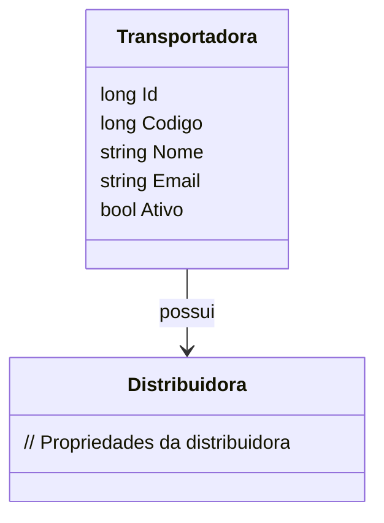

# Transportadora
**Namespace**: IsthmusWinthor.Dominio.Entidades  
**Nome do Arquivo**: Transportadora.cs  

## Visão Geral e Responsabilidade
A classe `Transportadora` atua como um modelo rico no domínio, representando uma entidade que faz a gestão das informações de transportadoras dentro do sistema. O problema de negócio que ela resolve envolve a organização e manutenção dos dados relacionados às transportadoras que realizam entregas para diferentes distribuidoras, assegurando que informações cruciais como o nome, código e status (ativo ou não) estejam corretamente geridas para facilitar operações logísticas.

## Métodos de Negócio
### Título: (não há métodos disponíveis com lógica complexa)

No momento, esta classe não apresenta métodos com lógica de negócio além de getters e setters padrão para suas propriedades.

## Propriedades Calculadas e de Validação
### Propriedades
- `Ativo`: Representa o estado da transportadora (ativa ou inativa). A regra por trás do uso dessa propriedade é que, quando marcada como `false`, a transportadora não deve ser considerada em futuras operações logísticas ou alocação de entregas.

## Navigation Property
- [Distribuidora](Distribuidora.md): Representa a associação entre `Transportadora` e `Distribuidora`, indicando a ligação entre as transportadoras e suas respectivas distribuidoras.

## Tipos Auxiliares e Dependências
- `IEntidade`: Interface que pode definir uma identidade para as entidades no domínio.

## Diagrama de Relacionamentos

Esta documentação é uma representação clara das responsabilidades e regras de negócio envolvidas na classe `Transportadora`, facilitando o entendimento e a manutenção do sistema por parte da equipe de desenvolvimento.
---
Gerada em 29/12/2025 20:50:47
