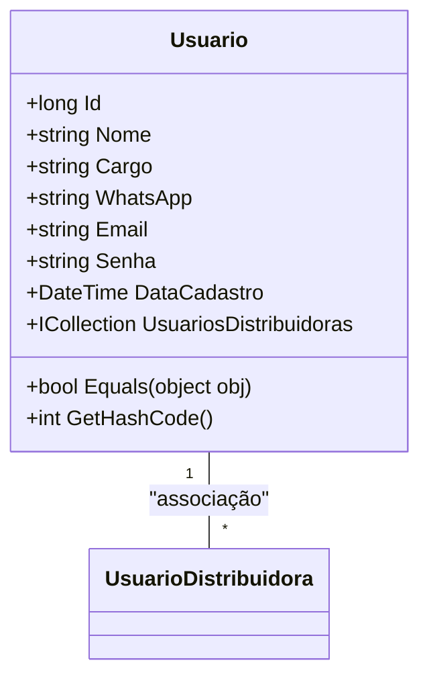

# Usuario

- **Namespace**: IsthmusWinthor.Dominio.Entidades  
- **Nome do Arquivo**: Usuario.cs

## Visão Geral e Responsabilidade
A classe `Usuario` representa um usuário do sistema, contendo informações essenciais como identificação, nome, cargo, e credenciais de contato. Ela aborda o problema de gerenciamento de usuários, garantindo que as informações sejam estruturadas e que as operações de igualdade sejam aplicáveis, sendo crucial para a identificação e a autenticação dentro da aplicação.

## Métodos de Negócio

### Título: Equals (override)
- **Objetivo**: Garante que a igualdade entre instâncias de `Usuario` seja baseada em propriedades chave definidas (Id, Nome, Email e Senha).
- **Comportamento**:
  1. Verifica se o objeto passado (`obj`) é do tipo `Usuario`.
  2. Compara o `Id`, `Nome`, `Email` e `Senha` do objeto atual com os do outro usuário.
  3. Retorna `true` se todas as propriedades igualadas forem iguais; caso contrário, retorna `false`.
- **Retorno**: Retorna um valor booleano indicando se os dois objetos `Usuario` são equivalentes.

### Título: GetHashCode (override)
- **Objetivo**: Garante que o código hash para a instância de `Usuario` seja baseado nas mesmas propriedades utilizadas na comparação de igualdade, permitindo uma melhor performance em coleções que utilizam hashing, como dicionários.
- **Comportamento**:
  1. Utiliza o método `HashCode.Combine` para gerar um valor hash a partir das propriedades `Id`, `Nome`, `Email`, e `Senha`.
- **Retorno**: Retorna um valor inteiro que serve como código hash para a instância de `Usuario`.

## Propriedades Calculadas e de Validação
Não há propriedades com lógica no `get` ou validação no `set` na classe `Usuario`.

## Navigation Property
- `UsuariosDistribuidoras`: Representa a relação entre `Usuario` e `UsuarioDistribuidora`.  
  Veja o arquivo presumido: `[UsuarioDistribuidora](UsuarioDistribuidora.md)`.

## Tipos Auxiliares e Dependências
Não há enumeradores ou classes estáticas/helpers utilizadas diretamente na classe `Usuario`.

## Diagrama de Relacionamentos

