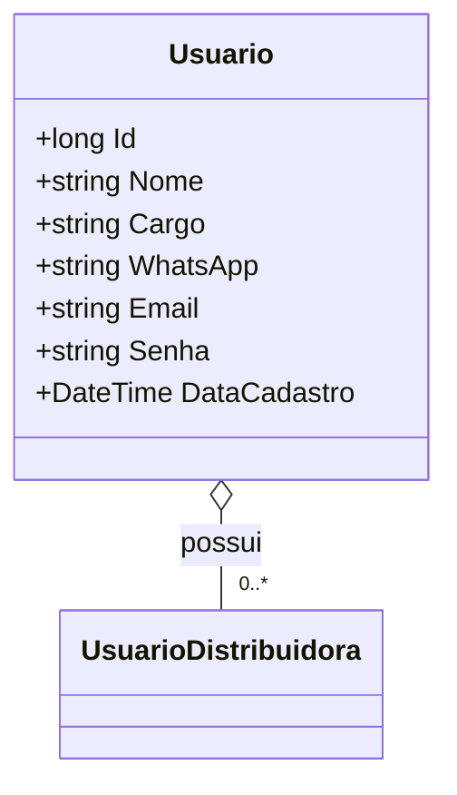

# Usuario
**Namespace**: IsthmusWinthor.Dominio.Entidades  
**Nome do Arquivo**: Usuario.cs  

## Visão Geral e Responsabilidade
A classe `Usuario` representa um usuário no sistema, sendo responsável por armazenar e gerenciar as informações básicas de um usuário, como nome, cargo, e contato. Essa entidade é fundamental para o gerenciamento de acessos e permissões dentro da aplicação, garantindo que cada usuário tenha suas informações corretamente agrupadas e identificáveis, o que facilita a administração de dados e integrações com outros sistemas.

## Métodos de Negócio
### Título: Equals (override)
- **Objetivo**: Garantir que dois objetos `Usuario` sejam considerados iguais se tiverem o mesmo `Id`, `Nome`, `Email`, e `Senha`. Isso é essencial para comparações, buscas e garantias de unicidade no sistema.
- **Comportamento**: 
  1. Verifica se o objeto recebido é um `Usuario`.
  2. Compara o `Id`, `Nome`, `Email`, e `Senha` do objeto atual com os valores correspondentes do objeto recebido.
  3. Retorna `true` se todos os valores forem iguais, caso contrário, retorna `false`.
- **Retorno**: Um booleano que indica se os dois objetos `Usuario` são iguais.

### Título: GetHashCode (override)
- **Objetivo**: Gerar um código hash que representa o estado do objeto `Usuario` baseado em seu `Id`, `Nome`, `Email`, e `Senha`. Esse método é importante para a utilização em estruturas de dados que exigem rápida localização, como dicionários.
- **Comportamento**: 
  1. Utiliza o método `HashCode.Combine` para gerar um código hash com base em `Id`, `Nome`, `Email`, e `Senha`.
  2. Retorna o código hash resultante.
- **Retorno**: Um valor inteiro que serve como código hash representa o objeto `Usuario`.

## Propriedades Calculadas e de Validação
- Não há propriedades que possuam lógica no `get` ou validação no `set` nesta classe.

## Navigations Property
- `UsuariosDistribuidoras`: Representa a coleção de associações entre usuários e distribuidoras. Essa propriedade conecta a classe `Usuario` à classe `UsuarioDistribuidora`, permitindo o acesso à distribuição de usuários.
  - [UsuarioDistribuidora](UsuarioDistribuidora.md)

## Tipos Auxiliares e Dependências
- Nenhum enumerador ou classe estática/helper é utilizado nesta classe.

## Diagrama de Relacionamentos

---
Gerada em 29/12/2025 20:50:59
