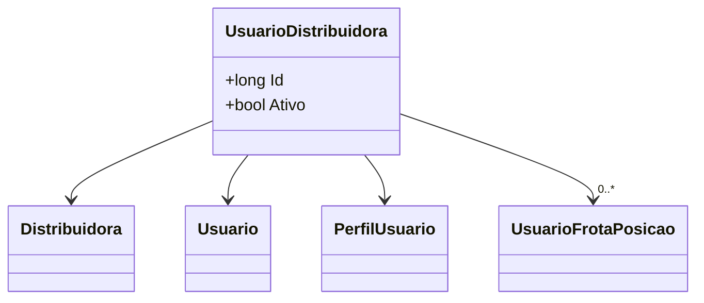

# UsuarioDistribuidora
**Namespace**: IsthmusWinthor.Dominio.Entidades  
**Nome do Arquivo**: UsuarioDistribuidora.cs  

## Visão Geral e Responsabilidade
A classe `UsuarioDistribuidora` representa a associação entre um usuário e uma distribuidora no contexto do sistema, permitindo o controle de permissões e funções que o usuário pode exercer dentro da distribuidora. Esta classe é critical para o gerenciamento de acessos e atividades dos usuários, garantindo que cada um deles tenha as permissões corretas conforme o seu perfil.

## Métodos de Negócio
Não há métodos com lógica condicional complexa nesta classe.

## Propriedades Calculadas e de Validação
Não há propriedades calculadas ou com validação de valores nesta classe.

## Navigations Property
- `Distribuidora`: [Distribuidora](Distribuidora.md)
- `Usuario`: [Usuario](Usuario.md)
- `PerfilUsuario`: [PerfilUsuario](PerfilUsuario.md)
- `Posicoes`: [UsuarioFrotaPosicao](UsuarioFrotaPosicao.md)

## Tipos Auxiliares e Dependências
- `PerfilUsuario`: [PerfilUsuario](PerfilUsuario.md)

## Diagrama de Relacionamentos

---
Gerada em 29/12/2025 20:51:05
