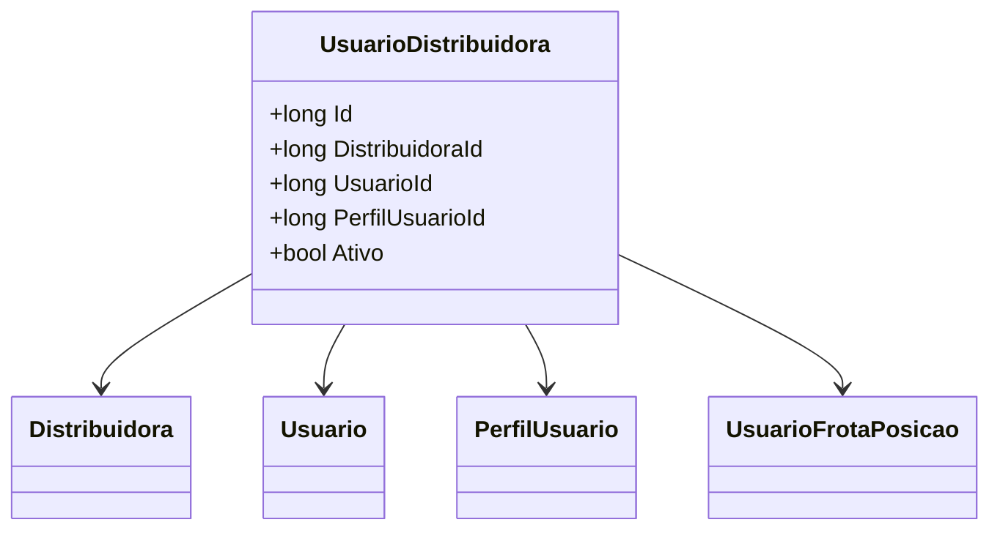

# UsuarioDistribuidora
**Namespace**: IsthmusWinthor.Dominio.Entidades  
**Nome do Arquivo**: UsuarioDistribuidora.cs  

## Visão Geral e Responsabilidade
A classe `UsuarioDistribuidora` representa a associação entre um usuário e uma distribuidora no sistema. Ela é responsável por controlar as permissões e o acesso do usuário a uma distribuidora específica, garantindo que as operações possam ser geridas de maneira adequada e segura. Essa estrutura permite uma gestão precisa sobre quem pode acessar e operar em determinadas distribuidoras, além de possibilitar uma clara separação de responsabilidades entre usuários e suas respectivas associações.

## Métodos de Negócio
- **Título**: (Métodos não disponíveis)
- **Objetivo**: Não existem métodos com lógica definida nesta implementação.
- **Comportamento**: N/A
- **Retorno**: N/A

## Propriedades Calculadas e de Validação
- N/A

## Navigation Properties
- [`Distribuidora`](Distribuidora.md): Representa a distribuidora associada ao usuário.
- [`Usuario`](Usuario.md): Representa o usuário ao qual a associação pertence.
- [`PerfilUsuario`](PerfilUsuario.md): Representa o perfil associado ao usuário dentro da distribuidora.
- [`Posicoes`](UsuarioFrotaPosicao.md): Coleção de posições de frota do usuário.

## Tipos Auxiliares e Dependências
- [`Distribuidora`](Distribuidora.md): Classe utilizada para representar uma distribuidora.
- [`Usuario`](Usuario.md): Classe utilizada para representar um usuário do sistema.
- [`PerfilUsuario`](PerfilUsuario.md): Classe utilizada para representar o perfil do usuário.
- [`UsuarioFrotaPosicao`](UsuarioFrotaPosicao.md): Classe utilizada para representar as posições de frota.

## Diagrama de Relacionamentos

