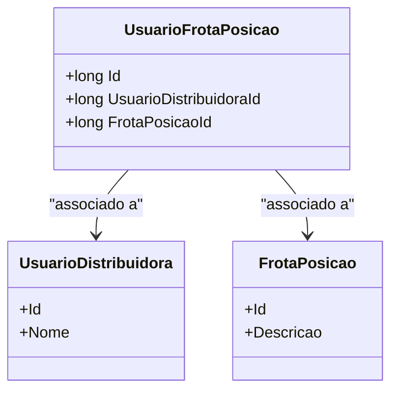

# UsuarioFrotaPosicao

**Namespace**: IsthmusWinthor.Dominio.Entidades  
**Nome do Arquivo**: UsuarioFrotaPosicao.cs

## Visão Geral e Responsabilidade
A classe `UsuarioFrotaPosicao` representa a entidade que mapeia a relação entre um usuário de distribuidora e sua respectiva posição na frota. O papel desta classe é gerenciar o estado e as associações entre usuários e posições de frota, garantindo que os dados sejam incorporados de maneira coesa, facilitando a manipulação e rastreamento das posições dos usuários dentro de suas frotas.

## Propriedades Calculadas e de Validação
Não há propriedades calculadas ou de validação nesta classe.

## Navigations Property
- `[UsuarioDistribuidora](UsuarioDistribuidora.md)`
- `[FrotaPosicao](FrotaPosicao.md)`

## Tipos Auxiliares e Dependências
- **Enums**: Não há enumeradores utilizados nesta classe.
- **Classes Estáticas/Helpers**: Não há classes estáticas mencionadas.

## Diagrama de Relacionamentos

