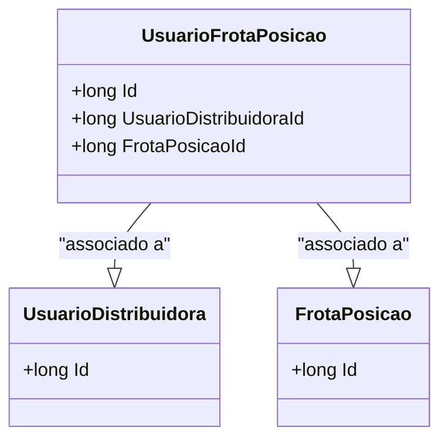

# UsuarioFrotaPosicao
**Namespace**: IsthmusWinthor.Dominio.Entidades  
**Nome do Arquivo**: UsuarioFrotaPosicao.cs  

## Visão Geral e Responsabilidade
A classe `UsuarioFrotaPosicao` representa a associação entre um usuário da distribuidora e uma posição de frota no sistema. Sua principal responsabilidade é gerenciar o relacionamento entre esses dois elementos, garantindo que as informações de associação sejam mantidas de forma íntegra. Essa modelagem é fundamental para o correto funcionamento das operações logísticas e rastreamento dentro do contexto da frota, permitindo uma gestão eficiente dos recursos.

## Métodos de Negócio
A classe `UsuarioFrotaPosicao` não contém métodos de negócio com lógica complexa, focando apenas em armazenar os dados referentes à associação entre usuários e suas posições de frota.

## Propriedades Calculadas e de Validação
A classe não possui propriedades calculadas ou validações em suas getters ou setters. Todas as propriedades são simples, assegurando que os dados de associação sejam definidos diretamente.

## Navigation Property
- [UsuarioDistribuidora](UsuarioDistribuidora.md)
- [FrotaPosicao](FrotaPosicao.md)

## Tipos Auxiliares e Dependências
- [IEntidade](IEntidade.md)

## Diagrama de Relacionamentos

---
Gerada em 29/12/2025 20:51:14
