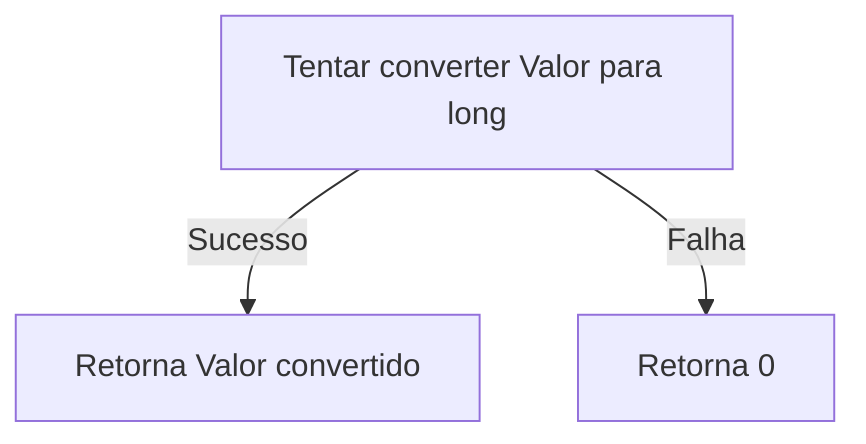
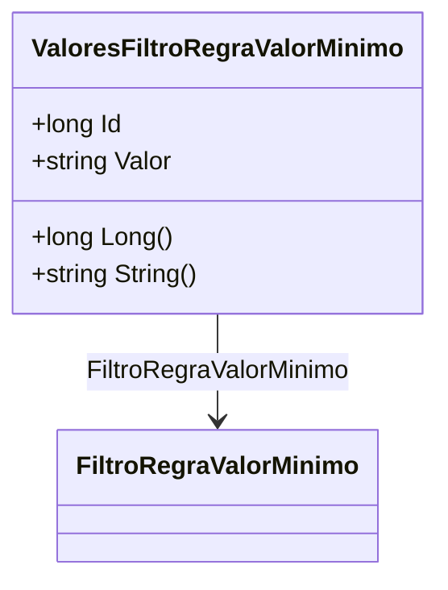

# ValoresFiltroRegraValorMinimo
**Namespace**: IsthmusWinthor.Dominio.Entidades  
**Nome do Arquivo**: ValoresFiltroRegraValorMinimo.cs  

## Visão Geral e Responsabilidade
A classe `ValoresFiltroRegraValorMinimo` representa os valores que são utilizados como filtro para a verificação de uma regra de valor mínimo. Ela lida com a conversão de um valor em formato de string para seu equivalente numérico (long) e fornece uma representação de string, assegurando que os valores sejam manipulados e validados de maneira consistente. Esta classe resolve o problema de garantir que os dados fornecidos para as regras de negócio estejam no formato correto e possam ser avaliados sem erros.

## Métodos de Negócio

### Título: Long() - Visibilidade: public 
- **Objetivo**: Este método garante a conversão do valor armazenado em `Valor` para um tipo numérico (long) e assegura que, caso a conversão falhe, um valor padrão (0) seja retornado.
- **Comportamento**: 
  1. Inicializa a variável `valueOut` com 0.
  2. Tenta converter o valor em `Valor` para um tipo long utilizando `long.TryParse`.
  3. Se a conversão for bem-sucedida, retorna o valor convertido.
  4. Se a conversão falhar, retorna 0.
  

### Título: String() - Visibilidade: public 
- **Objetivo**: Este método assegura que o valor seja retornado como uma string, tratando casos onde o valor é nulo ou vazio.
- **Comportamento**:
  1. Verifica se `Valor` é nulo ou vazio.
  2. Retorna uma string vazia se for o caso.
  3. Caso contrário, retorna o valor de `Valor` normalmente.
  
## Propriedades Calculadas e de Validação
- Nenhuma propriedade com lógica de cálculo ou validação foi identificada nesta classe, uma vez que os métodos são responsáveis por manipular a conversão de valores.

## Navigation Property
- `FiltroRegraValorMinimo`: `[FiltroRegraValorMinimo](FiltroRegraValorMinimo.md)`

## Tipos Auxiliares e Dependências
- Nenhum enumerador ou classe estática/Helper foi utilizado nesta classe.

## Diagrama de Relacionamentos

