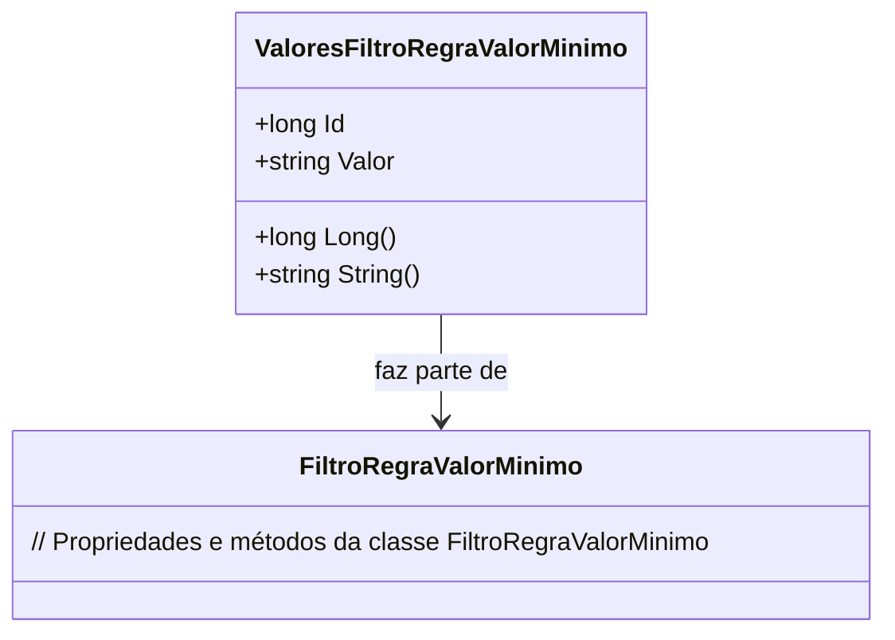

# ValoresFiltroRegraValorMinimo
**Namespace**: IsthmusWinthor.Dominio.Entidades  
**Nome do Arquivo**: ValoresFiltroRegraValorMinimo.cs  

## Visão Geral e Responsabilidade
A classe `ValoresFiltroRegraValorMinimo` atua como um modelo do domínio, representando os valores específicos associados a uma regra de filtro de valor mínimo. O principal objetivo da classe é garantir que os valores que estão sendo tratados como parte de uma lógica de negócios atendam a certas condições e formatos apropriados. Isso é crucial para a integridade de dados, especialmente em sistemas onde a validação e a formatação adequada dos valores são necessárias para evitar erros ao processar informações financeiras ou de controle.

## Métodos de Negócio

### Título: Long() - Público
- **Objetivo**: Esse método garante que o valor fornecido seja convertido em um tipo numérico (long) de forma segura, evitando exceções no caso de valores inválidos.
- **Comportamento**:
    1. Inicializa a variável `valueOut` como 0.
    2. Tenta converter a string `Valor` em um número long usando `long.TryParse`.
    3. Se a conversão for bem-sucedida, retorna o valor convertido.
    4. Caso contrário, retorna 0.
- **Retorno**: Retorna o valor como um `long`, ou 0 se a conversão falhar.

### Título: String() - Público
- **Objetivo**: Este método assegura que a string `Valor` seja retornada de forma adequada, evitando strings nulas ou vazias.
- **Comportamento**:
    1. Verifica se `Valor` é nulo ou vazio.
    2. Se for, retorna uma string vazia.
    3. Caso contrário, retorna o valor da propriedade `Valor`.
- **Retorno**: Retorna uma string que representa o valor armazenado ou uma string vazia se o valor não for apropriado.

## Propriedades Calculadas e de Validação
- **Valor**: Esta propriedade deve sempre conter uma string que represente um valor válido. A classe não implementa validação explícita, mas os métodos `Long()` e `String()` cuidam da manipulação e formatação.

## Navigations Property
- [FiltroRegraValorMinimo](FiltroRegraValorMinimo.md): Representa a associação com a entidade `FiltroRegraValorMinimo`, que detalha a regra de negócio associada.

## Tipos Auxiliares e Dependências
- Nenhum enumerador ou classe estática é utilizado nessa classe.

## Diagrama de Relacionamentos

---
Gerada em 29/12/2025 20:51:26
