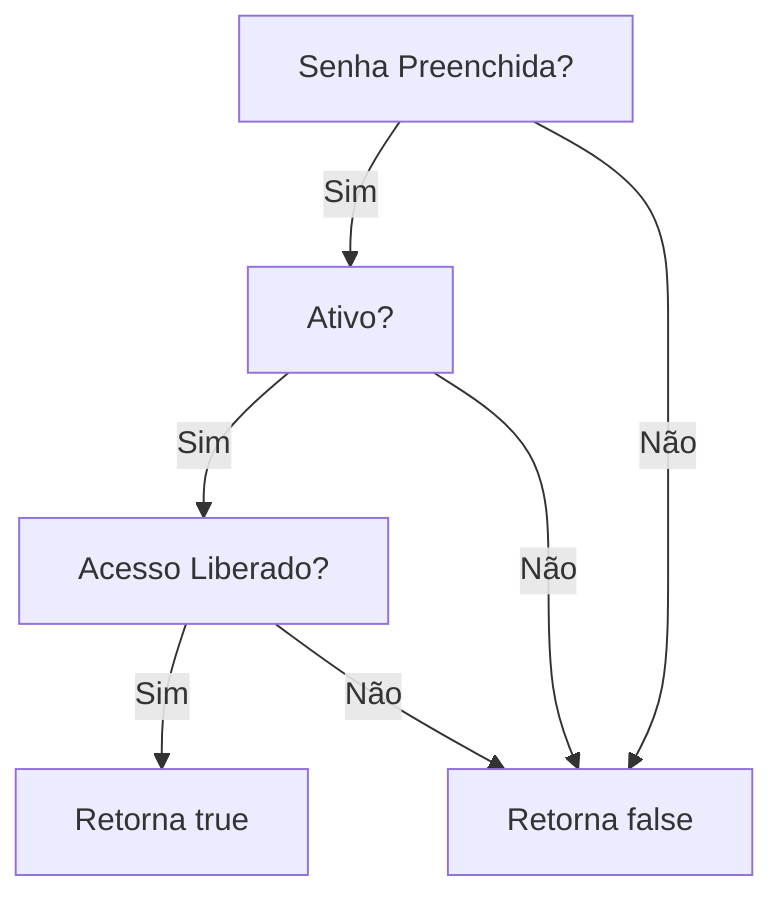
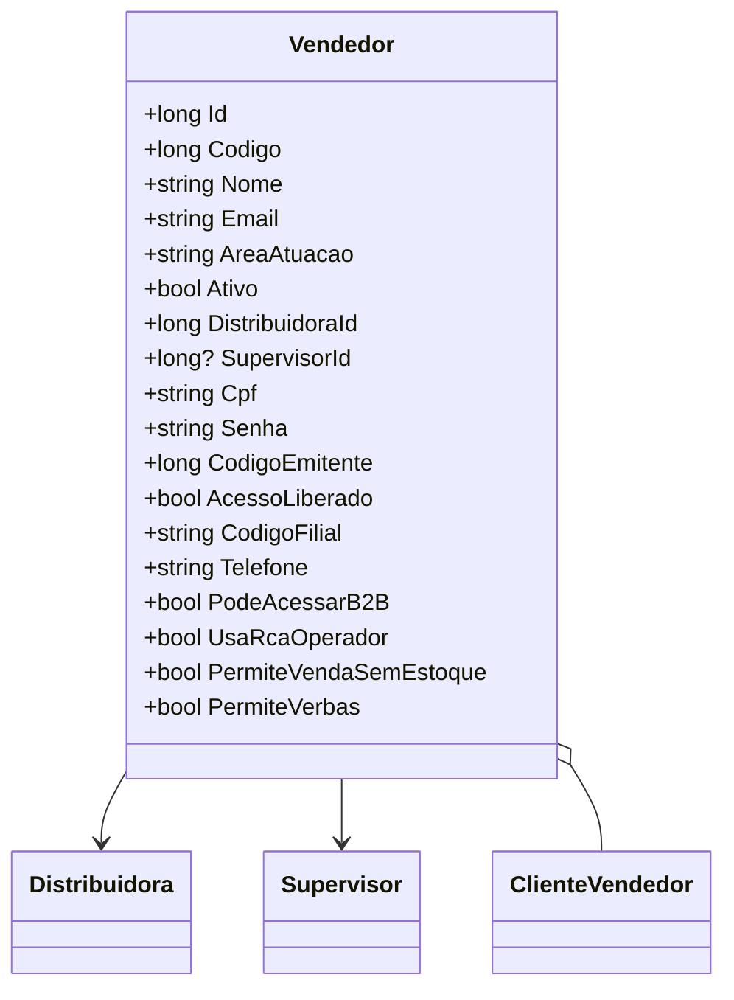

# Vendedor
- **Namespace**: IsthmusWinthor.Dominio.Entidades
- **Nome do Arquivo**: Vendedor.cs

## Visão Geral e Responsabilidade
A classe `Vendedor` representa um vendedor do sistema e suas informações. O papel dessa classe é modelar as propriedades e regras associadas a um vendedor, incluindo a sua relação com distribuidores, supervisores, e clientes. O problema de negócio que esta classe resolve é a gestão de vendedores, permitindo diferenciar e controlar o acesso e permissões de cada vendedor no contexto do sistema.

## Métodos de Negócio
### Título: PodeAcessarB2B (Propriedade)
- **Objetivo**: Garante a validação do acesso a funcionalidades do sistema B2B com base em critérios específicos.
- **Comportamento**: 
  1. Verifica se a `Senha` do vendedor não está vazia.
  2. Verifica se o vendedor está marcado como `Ativo`.
  3. Verifica se o `AcessoLiberado` é verdadeiro.
- **Retorno**: Retorna um valor booleano (`true` ou `false`), indicando se o vendedor tem permissão para acessar o sistema B2B.

## Propriedades Calculadas e de Validação
- **PodeAcessarB2B**: Esta propriedade é calculada com base na presença da `Senha`, estado de `Ativo` e condição de `AcessoLiberado`. Ela garante que apenas vendedores ativos e autorizados possam acessar o sistema B2B.

## Navigations Property
- [Distribuidora](Distribuidora.md): Representa a distribuidora associada ao vendedor.
- [Supervisor](Supervisor.md): Representa o supervisor que lidera o vendedor.
- [ClienteVendedor](ClienteVendedor.md): Coleção de clientes associados a este vendedor.

## Tipos Auxiliares e Dependências
- Nenhum enumerador ou classe estática/helper foi identificado nesta classe.

## Diagrama de Relacionamentos

---
Gerada em 29/12/2025 20:51:39
