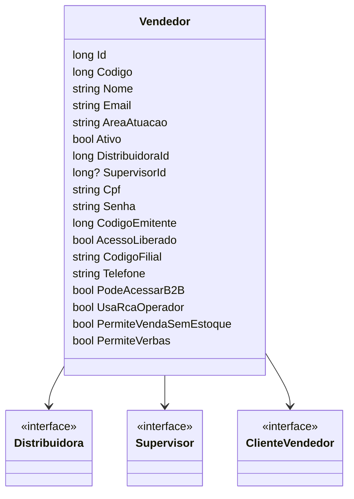

# Vendedor
**Namespace**: IsthmusWinthor.Dominio.Entidades  
**Nome do Arquivo**: Vendedor.cs  

## Visão Geral e Responsabilidade
A classe `Vendedor` representa um vendedor dentro do sistema, englobando informações fundamentais como código, nome, e credenciais necessárias para operações comerciais. Sua principal responsabilidade é garantir que os vendedores sejam gerenciados adequadamente, incluindo validações de acesso e atribuições a distribuidores e supervisores.

## Métodos de Negócio
### 1. PodeAcessarB2B (Propriedade Calculada)
- **Objetivo**: Determinar se o vendedor tem permissão para acessar a plataforma B2B.
- **Comportamento**: A propriedade retorna `true` se a senha não estiver vazia, se o vendedor estiver ativo e se o acesso estiver liberado. Caso contrário, retorna `false`.
- **Retorno**: Um valor booleano que indica a permissão de acesso ao B2B.

## Propriedades Calculadas e de Validação
- **PodeAcessarB2B**
  - A regra de negócio que sustenta essa propriedade é garantir que somente vendedores com informações completas e com status ativo possam acessar a plataforma B2B.

## Navigations Property
- `[Distribuidora](Distribuidora.md)`
- `[Supervisor](Supervisor.md)`
- `[ClienteVendedor](ClienteVendedor.md)`

## Tipos Auxiliares e Dependências
- **Enums**:
  - Nenhum identificável de acordo com o código fornecido.
- **Classes Estáticas/Helpers**:
  - Nenhum identificável de acordo com o código fornecido.

## Diagrama de Relacionamentos

Essa documentação busca proporcionar um entendimento claro sobre as regras de negócio que regem a classe `Vendedor`, abordando as propriedades, métodos e suas interconexões.
