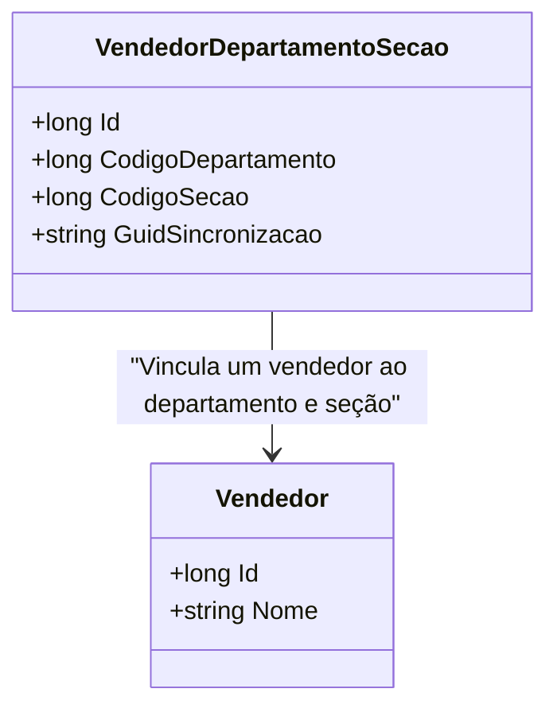

# VendedorDepartamentoSecao
**Namespace**: IsthmusWinthor.Dominio.Entidades  
**Nome do Arquivo**: VendedorDepartamentoSecao.cs  

## Visão Geral e Responsabilidade
A classe `VendedorDepartamentoSecao` representa a associação entre um vendedor e as seções e departamentos aos quais ele pertence. Esta classe é fundamental para a estrutura organizacional de vendas, permitindo que as informações sobre quais seções e departamentos um vendedor opera sejam armazenadas e gerenciadas eficientemente. Isso resolve o problema de mapeamento e organização dos vendedores nas diferentes áreas da empresa, essencial para o controle de vendas e relatórios.

## Métodos de Negócio
Não foram encontrados métodos com lógica significativa, apenas propriedades de entidade simples.

## Propriedades Calculadas e de Validação
- Nenhuma propriedade calculada ou de validação foi identificada nesta classe.

## Navigation Property
- [Vendedor](Vendedor.md): Representa a classe complexa que relaciona um vendedor a esta entidade.

## Tipos Auxiliares e Dependências
- Nenhum enumerador ou classe estática foi utilizado nesta classe.

## Diagrama de Relacionamentos

---
Gerada em 29/12/2025 20:51:45
