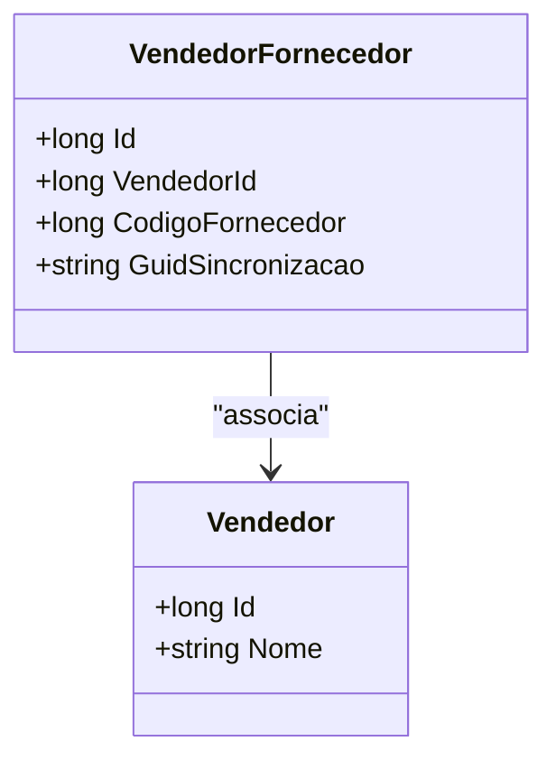

# VendedorFornecedor

**Namespace**: IsthmusWinthor.Dominio.Entidades  
**Nome do Arquivo**: VendedorFornecedor.cs  

## Visão Geral e Responsabilidade
A classe `VendedorFornecedor` representa uma associação entre um vendedor e um fornecedor. Isso é crucial para o gerenciamento de vendas, uma vez que permite que a organização mantenha um registro dos vendedores que estão associados a fornecedores específicos. O problema de negócio que esta classe resolve é a necessidade de vincular dados de vendedores a fornecedores, facilitando a integração e a sincronização de informações no sistema.

## Métodos de Negócio
Atualmente, a classe `VendedorFornecedor` não contém métodos com lógica de negócio; seus métodos se limitam a operações de acesso a dados. A lógica principal reside nas associações entre suas propriedades.

## Propriedades Calculadas e de Validação
A classe não possui propriedades calculadas ou de validação conforme o padrão observado.

## Navigations Property
- [Vendedor](Vendedor.md): Representa a entidade do vendedor associada.

## Tipos Auxiliares e Dependências
- `IEntidade`: Interface do qual `VendedorFornecedor` herda, indicando que esta classe é uma entidade do domínio.

## Diagrama de Relacionamentos

---
Gerada em 29/12/2025 20:51:52
