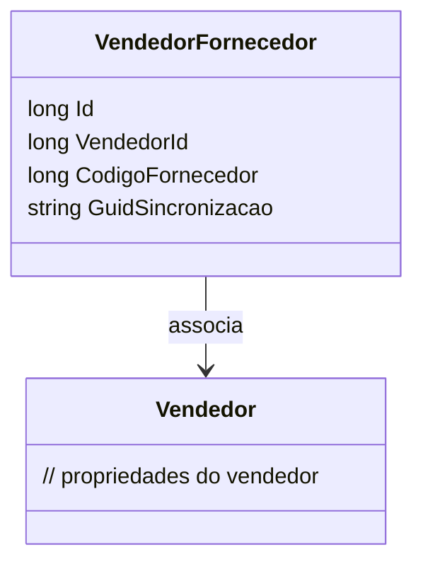

# VendedorFornecedor
- **Namespace**: IsthmusWinthor.Dominio.Entidades
- **Nome do Arquivo**: VendedorFornecedor.cs

## Visão Geral e Responsabilidade
A classe `VendedorFornecedor` representa a relação entre um vendedor e um fornecedor no domínio do sistema. Seu papel é associar informações sobre os vendedores que estão vinculados a diferentes fornecedores, permitindo a gestão eficiente da relação comercial entre eles. Isso é crucial para operações de venda, onde a identificação e registro do vendedor específico que gerencia um determinado fornecedor são essenciais para relatórios e análises de performance.

## Métodos de Negócio
*Nota: Esta classe não possui métodos com lógica de negócio complexa que justifiquem uma descrição detalhada neste segmento.*

## Propriedades Calculadas e de Validação
- Nenhuma propriedade na classe `VendedorFornecedor` possui lógica no `get` ou validação no `set`.

## Navigations Property
- [Vendedor](Vendedor.md): Representa a classe que contém informações do vendedor associado a este fornecedor.

## Tipos Auxiliares e Dependências
- Nenhum enumerador ou classe auxiliar está sendo utilizado nesta classe.

## Diagrama de Relacionamentos

