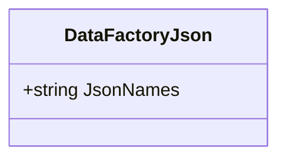

# DataFactoryJson
**Namespace**: IsthmusWinthor.Dominio.EntidadesAzure  
**Nome do Arquivo**: DataFactoryJson.cs  

## Visão Geral e Responsabilidade
A classe `DataFactoryJson` representa uma entidade que encapsula informações relativas a nomes de JSON utilizados na integração com o ambiente Azure. Seu principal papel é armazenar e gerenciar esses nomes, garantindo a integridade dos dados que serão utilizados em operações de processamento e análise. Esta classe soluciona a necessidade de um modelo que centraliza a identificação e o uso de arquivos JSON dentro do contexto da aplicação.

## Métodos de Negócio
Não há métodos de negócio complexos definidos nesta classe, apenas um `getter` e `setter` simples para a propriedade `JsonNames`.

## Propriedades Calculadas e de Validação
- **JsonNames**: Esta propriedade mantém uma lista de nomes de JSON. Não existe lógica de validação ou cálculo associada a ela dentro dessa implementação atual.

## Navigations Property
- Não existem propriedades de navegação complexas nesta classe.

## Tipos Auxiliares e Dependências
- **Nenhum**: A classe não depende de enumeradores ou classes estáticas/helpers adicionais.

## Diagrama de Relacionamentos

---
Gerada em 29/12/2025 20:51:57
