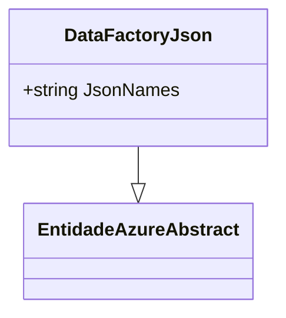

# DataFactoryJson
- **Namespace**: IsthmusWinthor.Dominio.EntidadesAzure
- **Nome do Arquivo**: DataFactoryJson.cs

> A classe `DataFactoryJson` atua como um objeto de transporte de dados que encapsula a propriedade `JsonNames`, que é utilizada para representar um conjunto de nomes em formato JSON.

### Propriedades Calculadas e de Validação
- `JsonNames`
  - Esta propriedade contém um string que representa nomes em formato JSON. Embora esta propriedade seja simples e anêmica, o uso dela deve ser validado em contextos onde se espera que os dados estejam corretamente formatados segundo a especificação JSON.

### Tipos Auxiliares e Dependências
- Nenhum enumerador ou classe auxiliar é utilizado nesta classe.

### Diagrama de Relacionamentos

