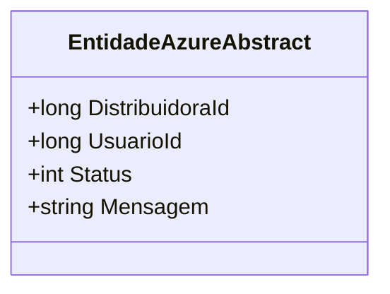

# EntidadeAzureAbstract
**Namespace**: IsthmusWinthor.Dominio.EntidadesAzure  
**Nome do Arquivo**: EntidadeAzureAbstract.cs  

## Visão Geral e Responsabilidade
A classe `EntidadeAzureAbstract` serve como uma base abstrata para entidades que são armazenadas no Azure Table Storage. Ela define as propriedades básicas que são comuns a diversas entidades, garantindo integração com o sistema de gerenciamento de tabelas do Azure. A principal responsabilidade desta classe é assegurar que todas as entidades derivadas possuam um conjunto padronizado de atributos que são necessários para a identificação e gerenciamento de dados, como ID de distribuidora, ID de usuário, status da entidade e uma mensagem relacionada. Esta padronização facilita a manipulação de dados e a aplicação de regras de negócio relacionadas a estados e identificações.

## Propriedades Calculadas e de Validação
Não existem propriedades com lógica de cálculo ou validação nesta classe, pois todas as propriedades são definidas diretamente como campos de dados que armazenam informações.

## Navigations Property
Não existem propriedades que são classes complexas do domínio nesta classe, pois ela atua apenas como uma classe base com propriedades primárias.

## Tipos Auxiliares e Dependências
Nenhum tipo auxiliar como Enums ou Classes Estáticas/Helpers são utilizados nesta classe.

## Diagrama de Relacionamentos

---
Gerada em 29/12/2025 20:52:04
