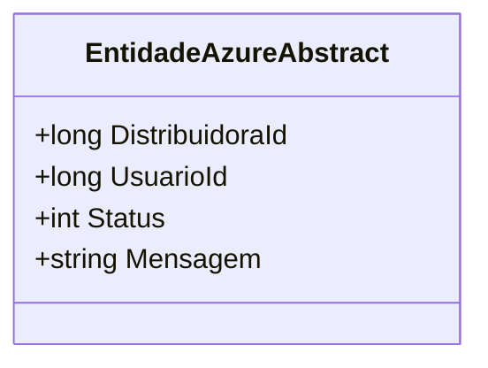

# EntidadeAzureAbstract

**Namespace**: IsthmusWinthor.Dominio.EntidadesAzure  
**Nome do Arquivo**: EntidadeAzureAbstract.cs  

## Visão Geral e Responsabilidade
A classe `EntidadeAzureAbstract` atua como uma estrutura base para entidades que serão armazenadas no Azure Table Storage. Ela define um modelo genérico que inclui propriedades essenciais para o gerenciamento de entidades, como `DistribuidoraId`, `UsuarioId`, `Status` e `Mensagem`. Este modelo garante que todas as entidades derivadas mantenham consistência em relação a atributos fundamentais, facilitando a integração e manipulação de dados dentro do serviço de armazenamento em nuvem.

## Propriedades Calculadas e de Validação
- **DistribuidoraId**: Representa a identificação da distribuidora associada. Deve sempre ser um valor válido (não negativo) para garantir a coerência na representação das entidades.
- **UsuarioId**: Identifica o usuário que gerencia ou é responsável pela entidade. Este ID deve ser verificado para garantir que corresponde a um usuário ativo no sistema.
- **Status**: Indica o estado atual da entidade (por exemplo, ativo, inativo, em processamento). O valor deve estar dentro de um conjunto predefinido de estados válidos, garantindo que apenas estados reconhecidos sejam utilizados.
- **Mensagem**: Um campo livre que pode conter informações adicionais referentes à entidade. Não deve ultrapassar um determinado limite de caracteres, para manutenção da integridade dos dados.

## Navigations Property
Não há propriedades que sejam classes complexas do domínio nesta classe abstrata.

## Tipos Auxiliares e Dependências
- Não há enumeradores ou classes auxiliares específicas utilizadas diretamente nesta classe.

## Diagrama de Relacionamentos

Esta documentação fornece uma visão clara sobre o papel e a estrutura da `EntidadeAzureAbstract` dentro do contexto de sistemas que utilizam o Azure para armazenamento de dados, enfatizando a importância das propriedades no contexto de integração e integridade de dados.
