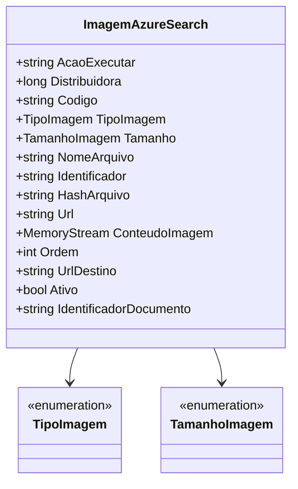

# ImagemAzureSearch

**Namespace**: IsthmusWinthor.Dominio.EntidadesAzure  
**Nome do Arquivo**: ImagemAzureSearch.cs  

## Visão Geral e Responsabilidade
A classe `ImagemAzureSearch` é um modelo rico de domínio que representa uma imagem dentro do contexto de um índice de busca no Azure. Seu principal papel é garantir que as informações sobre a imagem, como suas propriedades e ações, sejam corretamente integradas e estruturadas para operações de indexação e busca. Ela resolve o problema de gerenciamento eficiente de metadados relacionados a imagens no sistema, assegurando que todas as informações relevantes sejam mantidas de forma consistente.

## Métodos de Negócio
### Título: Equals (Visibilidade: public override)
- **Objetivo**: Garante que duas instâncias de `ImagemAzureSearch` sejam consideradas iguais se seus nomes de arquivo forem idênticos.
- **Comportamento**:
  - O método verifica se o objeto passado como parâmetro é uma instância de `ImagemAzureSearch`.
  - Compara a propriedade `NomeArquivo` do objeto atual com a do objeto passado.
- **Retorno**: Retorna um booleano `true` se os nomes de arquivo forem iguais, caso contrário retorna `false`.

### Título: GetHashCode (Visibilidade: public override)
- **Objetivo**: Garante que a implementação de hash da classe funcione corretamente em coleções que utilizam hashing.
- **Comportamento**:
  - A estrutura de hash é baseada na propriedade `NomeArquivo`, utilizando o método `HashCode.Combine` para calcular o código hash.
- **Retorno**: Retorna um valor inteiro que representa o hash da instância da classe.

## Propriedades Calculadas e de Validação
- `Identificador`: Esta propriedade gera um identificador único para a imagem usando a codificação Base64 do `NomeArquivo`. Isso assegura que cada arquivo tenha um identificador exclusivo, facilitando sua identificação de forma rápida e eficiente.

## Navigations Property
- Não há propriedades complexas de domínio ou navegação nesta classe.

## Tipos Auxiliares e Dependências
- **Enumeradores**:
  - `[TipoImagem](TipoImagem.md)`
  - `[TamanhoImagem](TamanhoImagem.md)`

## Diagrama de Relacionamentos

