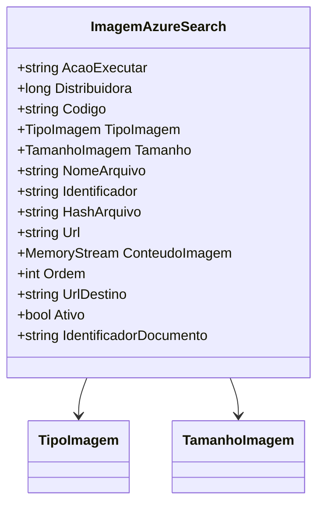

# ImagemAzureSearch
**Namespace**: IsthmusWinthor.Dominio.EntidadesAzure  
**Nome do Arquivo**: ImagemAzureSearch.cs  

## Visão Geral e Responsabilidade
A classe `ImagemAzureSearch` atua como um modelo de domínio rico que representa uma imagem armazenada em um índice de busca do Azure. A principal responsabilidade desta classe é encapsular as propriedades e comportamentos relacionados a uma imagem, permitindo sua manipulação e representação no sistema. Ela facilita o gerenciamento de dados de imagem, como o conteúdo, o tipo e a relação com a distribuidora, assegurando que os dados estejam formatados corretamente para serem indexados na busca. Essa classe também utiliza lógica para gerar um identificador único da imagem e contém propriedades que gerenciam o estado de ativação e ordem da imagem.

## Métodos de Negócio

### Método: `Equals` (override)
- **Objetivo**: Garantir que duas instâncias de `ImagemAzureSearch` sejam consideradas iguais se seus nomes de arquivo forem idênticos.
- **Comportamento**: O método compara o `NomeArquivo` da instância atual com o `NomeArquivo` da instância fornecida como parâmetro. Se ambos forem iguais, retorna verdadeiro; caso contrário, retorna falso.
- **Retorno**: Um booleano que indica se duas instâncias de `ImagemAzureSearch` são consideradas iguais.

### Método: `GetHashCode` (override)
- **Objetivo**: Fornecer um valor de hash consistente que represente a classe `ImagemAzureSearch` em coleções baseadas em hash.
- **Comportamento**: Este método gera um código hash com base no `NomeArquivo` da instância, utilizando a função de hash combinada para assegurar que objetos iguais gerem o mesmo código.
- **Retorno**: Um inteiro que é o código hash calculado da instância.

## Propriedades Calculadas e de Validação

### Propriedade: `Identificador`
- **Regra**: Esta propriedade é uma representação codificada em Base64 do `NomeArquivo`. A lógica garante que, independentemente do conteúdo do nome do arquivo, um identificador único e seguro seja gerado e utilizado para identificação no índice de busca.

## Navigations Property
- `TipoImagem`: [TipoImagem](TipoImagem.md)
- `Tamanho`: [TamanhoImagem](TamanhoImagem.md)

## Tipos Auxiliares e Dependências
- `TipoImagem`: [TipoImagem](TipoImagem.md)
- `TamanhoImagem`: [TamanhoImagem](TamanhoImagem.md)

## Diagrama de Relacionamentos

---
Gerada em 29/12/2025 20:52:16
