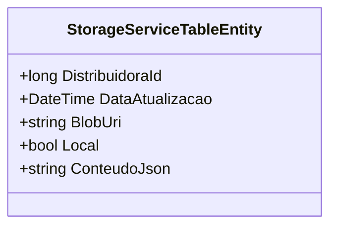

# StorageServiceTableEntity
**Namespace**: IsthmusWinthor.Dominio.EntidadesAzure  
**Nome do Arquivo**: StorageServiceTableEntity.cs  

## Visão Geral e Responsabilidade
A classe `StorageServiceTableEntity` representa uma entidade que armazena dados relacionados a um serviço de armazenamento na tabela do Azure. Sua responsabilidade principal é manter as informações referentes a uma distribuidora, incluindo o ID da distribuidora, a data de atualização, e a URI do Blob, que são fundamentais para garantir a integridade e atualização dos dados armazenados em um serviço de nuvem. Esta classe facilita o acesso e a manipulação dos dados necessários para operações de armazenamento na tabela.

## Métodos de Negócio
*Nota: A classe não possui métodos de negócio implícitos, pois consiste apenas em propriedades anêmicas para transporte de dados.*

## Propriedades Calculadas e de Validação
- **Não há propriedades que contenham lógica de cálculo ou validação.** Todas as propriedades são anêmicas, refletindo diretamente valores que podem ser atribuídos e recuperados sem lógica adicional.

## Navigations Property
- **Não há propriedades complexas que representem navegações dentro do domínio.** Todas as propriedades são simples tipos de dados.

## Tipos Auxiliares e Dependências
- **Não há tipos auxiliares ou dependências externas como Enums ou classes estáticas que esta classe utiliza.**

## Diagrama de Relacionamentos

---
Gerada em 29/12/2025 20:52:24
