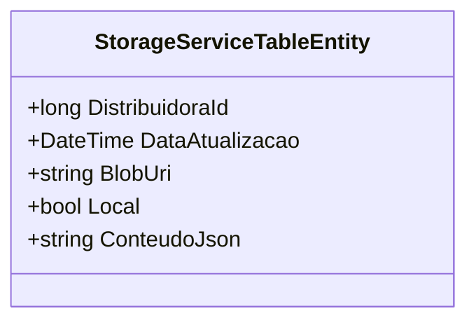

# StorageServiceTableEntity
**Namespace**: IsthmusWinthor.Dominio.EntidadesAzure  
**Nome do Arquivo**: StorageServiceTableEntity.cs  

### Visão Geral e Responsabilidade
A classe `StorageServiceTableEntity` representa uma entidade que armazena informações relacionadas ao serviço de armazenamento utilizando o Azure Table Storage. O objetivo principal dessa entidade é gerenciar dados que são associados a uma distribuidora, permitindo a atualização e armazenamento eficiente dos conteúdos em formato JSON, além de manter um registro da data de atualização e da localização dos dados.

### Métodos de Negócio
Nesta classe, não há métodos de negócio implementados que contenham lógica complexa, sendo a classe centrada em propriedades anêmicas.

### Propriedades Calculadas e de Validação
- Não existem propriedades na classe que contenham lógica em seu `get` ou validação em seu `set`.

### Navigation Property
- Não há propriedades que representam classes complexas do domínio nesta classe.

### Tipos Auxiliares e Dependências
- Não há tipos auxiliares ou classes estáticas utilizadas diretamente por esta classe.

### Diagrama de Relacionamentos

