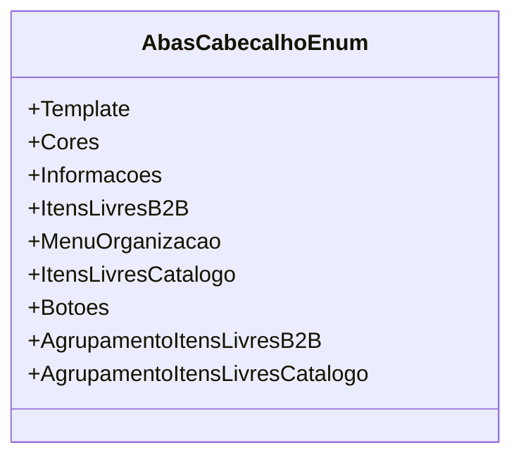

# AbasCabecalhoEnum
**Namespace**: IsthmusWinthor.Dominio.Enumeradores  
**Nome do Arquivo**: AbasCabecalhoEnum.cs

Este é um enumerador que define os tipos de abas disponíveis em um cabeçalho de interface. Ele tem como principal objetivo proporcionar uma forma de categorização e referência consistente para os diferentes componentes de interface que serão utilizados no sistema, facilitando a manutenção e o entendimento da lógica de exibição.

## Tipos Auxiliares e Dependências
- Nenhuma dependência externa.
- Enumeradores listados:
  - `[AbasCabecalhoEnum](AbasCabecalhoEnum.md)`

## Diagrama de Relacionamentos

Esta documentação fornece uma visão clara sobre o papel do `AbasCabecalhoEnum` dentro da estrutura do domínio e suas interações com o sistema, garantindo a integridade e a clareza dos dados manipulados na aplicação.
