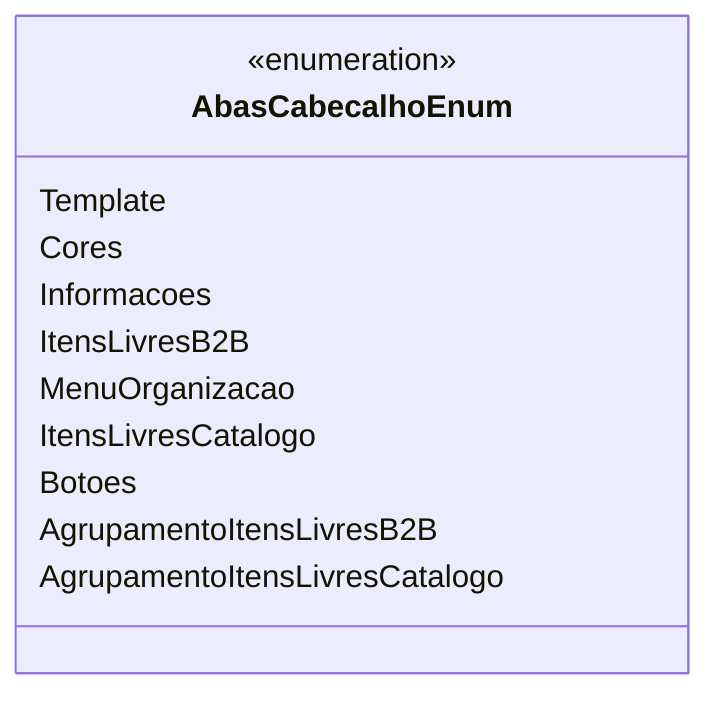

# AbasCabecalhoEnum
**Namespace**: IsthmusWinthor.Dominio.Enumeradores  
**Nome do Arquivo**: AbasCabecalhoEnum.cs  

Este é um enumerador que define os tipos de abas utilizadas na interface do usuário do sistema, categorizando elementos essenciais para a navegação e organização do conteúdo.

## Tipos Auxiliares e Dependências
- **Enumeradores**:
  - [AbasCabecalhoEnum](AbasCabecalhoEnum.md)

## Diagrama de Relacionamentos

---
Gerada em 29/12/2025 20:52:28
