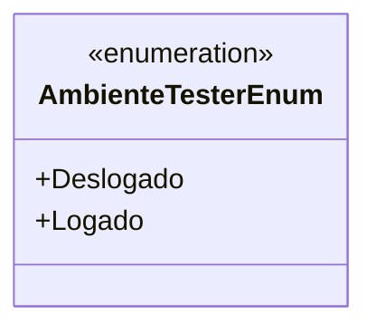

# AmbienteTesterEnum
**Namespace**: IsthmusWinthor.Dominio.Enumeradores  
**Nome do Arquivo**: AmbienteTesterEnum.cs  

`AmbienteTesterEnum` é um enumerador que define os estados de um ambiente de teste, determinando se um usuário está logado ou deslogado durante os testes.

## Tipos Auxiliares e Dependências
- Enumeradores:
  - `[AmbienteTesterEnum](AmbienteTesterEnum.md)`

## Diagrama de Relacionamentos

