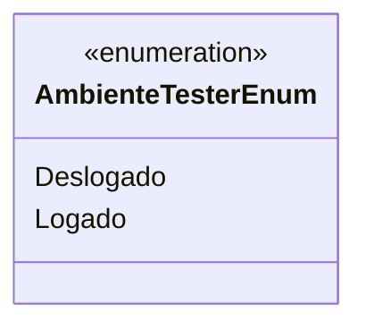

# AmbienteTesterEnum
**Namespace**: IsthmusWinthor.Dominio.Enumeradores  
**Nome do Arquivo**: AmbienteTesterEnum.cs  

Este enumerador define os estados do ambiente tester, sendo eles "Deslogado" e "Logado". Ele é utilizado para controlar o contexto de teste em diferentes cenários dentro da aplicação, permitindo que o sistema tome decisões com base no estado atual do ambiente.

## Tipos Auxiliares e Dependências
- **Enumeradores**:
  - [AmbienteTesterEnum](AmbienteTesterEnum.md)

## Diagrama de Relacionamentos

---
Gerada em 29/12/2025 20:52:31
