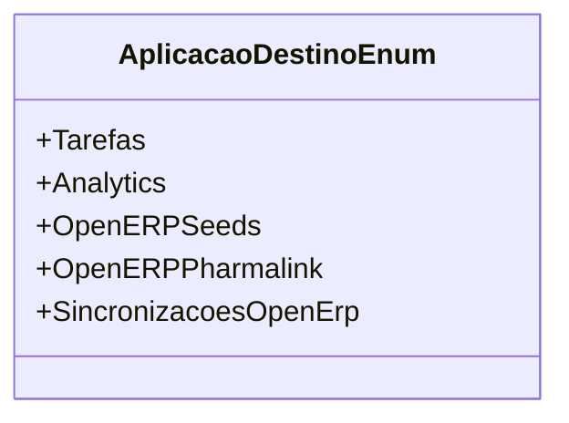

# AplicacaoDestinoEnum
**Namespace**: IsthmusWinthor.Dominio.Enumeradores  
**Nome do Arquivo**: AplicacaoDestinoEnum.cs  

Enumeração que define os diferentes destinos para aplicação, utilizada para categorizar a finalidade de dados no sistema.

---

## Tipos Auxiliares e Dependências
- **Enumeradores:**
  - [AplicacaoDestinoEnum](AplicacaoDestinoEnum.md)

--- 

## Diagrama de Relacionamentos

---
Gerada em 29/12/2025 20:52:34
