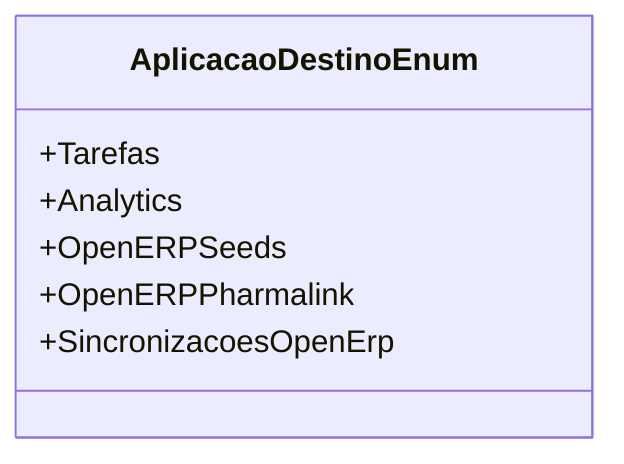

# AplicacaoDestinoEnum
**Namespace**: IsthmusWinthor.Dominio.Enumeradores  
**Nome do Arquivo**: AplicacaoDestinoEnum.cs  

AplicacaoDestinoEnum é um enumerador que fornece um conjunto de constantes que representam os diferentes destinos de aplicação para interações no sistema. Ele é utilizado para garantir que os destinos de aplicação sejam referenciados de maneira consistente e clara, promovendo a integridade dos dados e a legibilidade do código.

## Tipos Auxiliares e Dependências
- Enumerador: 
  - `[AplicacaoDestinoEnum](AplicacaoDestinoEnum.md)`

## Diagrama de Relacionamentos

