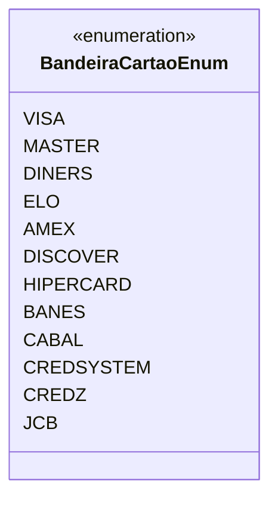

# BandeiraCartaoEnum
**Namespace**: IsthmusWinthor.Dominio.Enumeradores  
**Nome do Arquivo**: BandeiraCartaoEnum.cs  

O `BandeiraCartaoEnum` é uma enumeração que lista as bandeiras de cartões de crédito aceitas no sistema. Ele serve como um transportador de dados, permitindo que o código referencie as bandeiras de cartões por meio de constantes nomeadas, melhorando a legibilidade e a manutenção do código.

## Tipos Auxiliares e Dependências
- Nenhuma classe estática ou helper utilizada.
  
## Diagrama de Relacionamentos

---
Gerada em 29/12/2025 20:52:38
