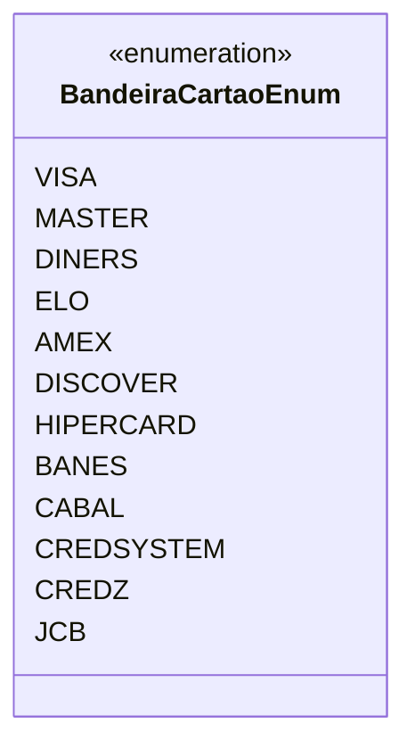

# BandeiraCartaoEnum
**Namespace**: IsthmusWinthor.Dominio.Enumeradores  
**Nome do Arquivo**: BandeiraCartaoEnum.cs  

O enum `BandeiraCartaoEnum` é responsável por definir as bandeiras de cartões de crédito e débito suportadas pelo sistema.

## Tipos Auxiliares e Dependências
- **Enumeradores**:
  - `BandeiraCartaoEnum` - Representa a lista de bandeiras de cartões disponíveis.

## Diagrama de Relacionamentos

