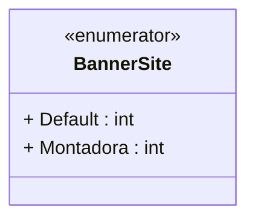

# BannerSite
**Namespace**: IsthmusWinthor.Dominio.Enumeradores  
**Nome do Arquivo**: BannerSite.cs  

## Visão Geral e Responsabilidade
A enumeração `BannerSite` define os diferentes tipos de banners que podem ser exibidos em um site. Essa classe é essencial para garantir a consistência e a integridade dos dados relacionados à apresentação de banners, permitindo que as partes do sistema que utilizam essa enumeração identifiquem facilmente os tipos de banners disponíveis e tratem suas funcionalidades de forma apropriada.

## Tipos Auxiliares e Dependências
- **Enumeradores**:
  - `Default`: Representa o banner padrão que deve ser usado quando nenhuma outra opção específica é fornecida.
  - `Montadora`: Representa um banner específico para montadoras, que pode ter características diferenciadas em relação ao banner padrão.

### Links para Tipos Auxiliares
- [BannerSite](BannerSite.md)

## Diagrama de Relacionamentos

A enumeração `BannerSite` é uma estrutura simples, mas crucial para a categorização de elementos visuais no sistema, contribuindo para a personalização e relevância do conteúdo apresentado ao usuário no site.
---
Gerada em 29/12/2025 20:52:44
