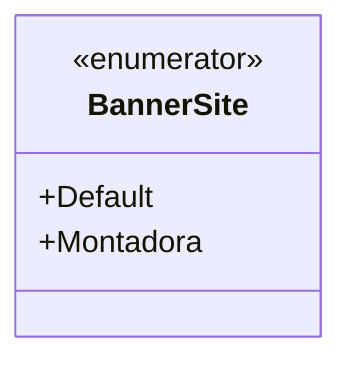

# BannerSite
**Namespace**: IsthmusWinthor.Dominio.Enumeradores  
**Nome do Arquivo**: BannerSite.cs  

O `BannerSite` é um enumerador que define tipos distintos de banners que podem ser usados na interface do site, contribuindo para a configuração e personalização da experiência do usuário.

### Tipos Auxiliares e Dependências
- **Enumeradores**:
  - `[BannerSite](BannerSite.md)`: Define os tipos de banner disponíveis.

### Diagrama de Relacionamentos

