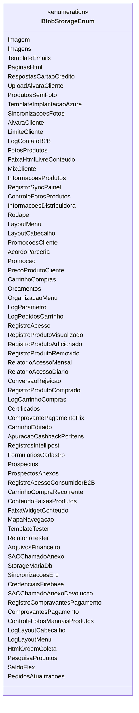

# BlobStorageEnum

**Namespace**: IsthmusWinthor.Dominio.Enumeradores  
**Nome do Arquivo**: BlobStorageEnum.cs  

O `BlobStorageEnum` é uma enumeração que define um conjunto de constantes representando diferentes tipos de dados que podem ser armazenados no Blob Storage. Essa enumeração é utilizada para identificar de forma clara e tipada as diferentes categorias de dados envolvidos no sistema.

## Tipos Auxiliares e Dependências
- **Classe/Enumerador**: Nenhum. Este arquivo contém apenas uma enumeração com valores estáticos. 

## Diagrama de Relacionamentos

Esta enumeração permite que outras partes do sistema façam referência a esses tipos de dados de maneira consistente e controlada, promovendo a integridade e legibilidade do código.
---
Gerada em 29/12/2025 20:52:57
