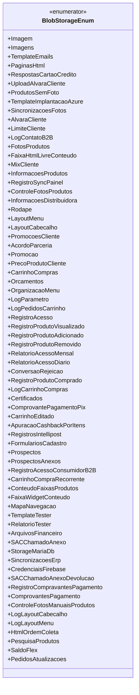

# BlobStorageEnum

**Namespace**: IsthmusWinthor.Dominio.Enumeradores  
**Nome do Arquivo**: BlobStorageEnum.cs  

O `BlobStorageEnum` é um enumerador utilizado para definir constantes relacionadas a diferentes tipos de dados armazenados no Windows Blob Storage. Sua arquitetura orientada a dados permite categorização e gerenciamento de arquivos de forma organizada, facilitando a integração entre os diversos componentes do sistema.

## Tipos Auxiliares e Dependências
- Nenhuma dependência de classe complexa do domínio ou navegations properties foram identificadas.
  
### Enumeradores
- `[BlobStorageEnum](BlobStorageEnum.md)` - Enumerador que lista os tipos de dados e documentos salvos no Blob Storage.

## Diagrama de Relacionamentos

