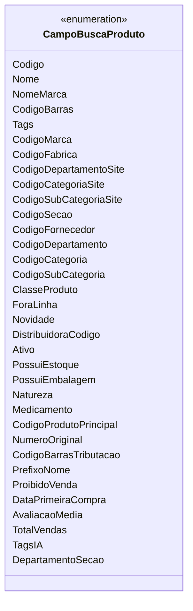

# CampoBuscaProduto
**Namespace**: IsthmusWinthor.Dominio.Enumeradores  
**Nome do Arquivo**: CampoBuscaProduto.cs  

O enum `CampoBuscaProduto` define os diferentes critérios que podem ser utilizados para a busca de produtos no sistema, permitindo uma flexibilidade na busca e recuperação de informações relacionadas a produtos.

## Tipos Auxiliares e Dependências
- Enumeradores:
  - [CampoBuscaProduto](CampoBuscaProduto.md)

## Diagrama de Relacionamentos

---
Gerada em 29/12/2025 20:53:04
