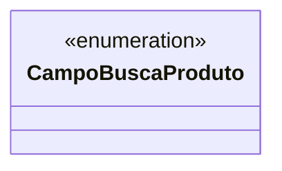

# CampoBuscaProduto
**Namespace**: IsthmusWinthor.Dominio.Enumeradores  
**Nome do Arquivo**: CampoBuscaProduto.cs  

CampoBuscaProduto é um enumerador que define os diversos campos disponíveis para busca de produtos no sistema. Ele proporciona uma forma estruturada de referenciar esses campos, garantindo a uniformidade em operações de pesquisa de produtos dentro do sistema.

## Tipos Auxiliares e Dependências
- **Enumeradores**:
  - `[CampoBuscaProduto](CampoBuscaProduto.md)`

## Diagrama de Relacionamentos

