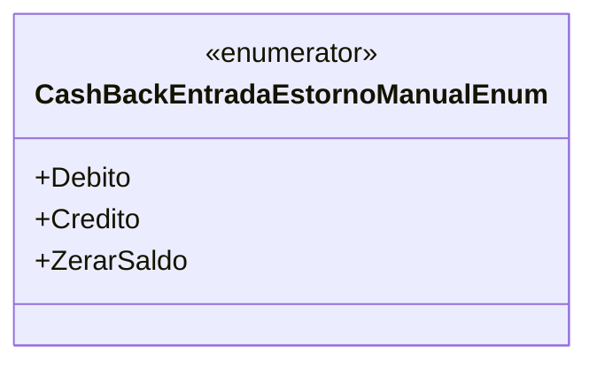

# CashBackEntradaEstornoManualEnum
**Namespace**: IsthmusWinthor.Dominio.Enumeradores  
**Nome do Arquivo**: CashBackEntradaEstornoManualEnum.cs  

Este enumerador tem a finalidade de categorizar os tipos de entrada no processo de estorno manual de cashback, permitindo a identificação clara de como o saldo será ajustado em decorrência de operações financeiras.

## Tipos Auxiliares e Dependências
- **Enums**:
  - [CashBackEntradaEstornoManualEnum](CashBackEntradaEstornoManualEnum.md)

## Diagrama de Relacionamentos

---
Gerada em 29/12/2025 20:53:08
