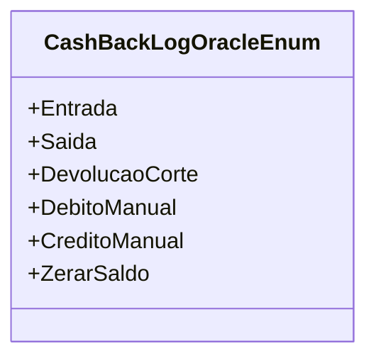

# CashBackLogOracleEnum
**Namespace**: IsthmusWinthor.Dominio.Enumeradores  
**Nome do Arquivo**: CashBackLogOracleEnum.cs  

O `CashBackLogOracleEnum` é utilizado para representar os diferentes tipos de logs associados ao sistema de Cashback. Este enumerador facilita a categorização e a identificação das operações realizadas, permitindo uma melhor organização e rastreamento das transações de cashback.

### Tipos Auxiliares e Dependências
- Não há classes complexas do domínio ou propriedades navegáveis a serem listadas, uma vez que se trata apenas de um enumerador. 

