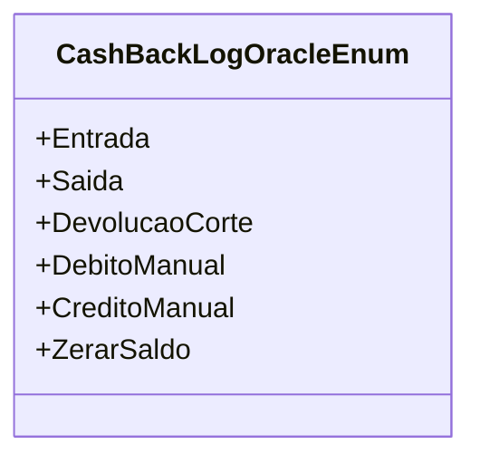

# CashBackLogOracleEnum
**Namespace**: IsthmusWinthor.Dominio.Enumeradores  
**Nome do Arquivo**: CashBackLogOracleEnum.cs  

Esta classe representa um enumerador que define os diferentes estados de operações relacionadas ao Cashback em um sistema de gerenciamento financeiro. Seu principal objetivo é estabelecer um conjunto de constantes que podem ser utilizadas em todo o sistema para identificar claramente as diferentes transações que afetam o saldo do cashback.

## Tipos Auxiliares e Dependências
- Nenhuma dependência de classe complexa do domínio.
  
### Enumeradores
- [CashBackLogOracleEnum](CashBackLogOracleEnum.md): Enumerador que categoriza as operações que podem ser realizadas no saldo de cashback.

## Diagrama de Relacionamentos

Este diagrama ilustra o enumerador `CashBackLogOracleEnum` que contém diferentes constantes para operações relacionadas a cashback.
---
Gerada em 29/12/2025 20:53:15
