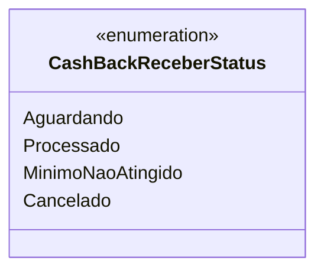

# CashBackReceberStatus
**Namespace**: IsthmusWinthor.Dominio.Enumeradores  
**Nome do Arquivo**: CashBackReceberStatus.cs  

O `CashBackReceberStatus` é um enumerador que define os possíveis estados do processo de recebimento de cashback dentro do sistema. Ele é fundamental para o controle do fluxo de transações de cashback, permitindo que o sistema identifique em qual etapa do ciclo de vida uma transação de cashback se encontra.  

## Tipos Auxiliares e Dependências
- **Enums**:
  - `[CashBackReceberStatus](CashBackReceberStatus.md)`

---

