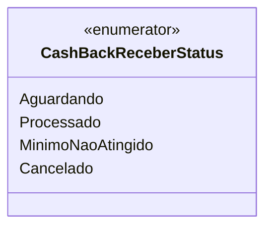

# CashBackReceberStatus
**Namespace**: IsthmusWinthor.Dominio.Enumeradores  
**Nome do Arquivo**: CashBackReceberStatus.cs  

O `CashBackReceberStatus` é um enumerador que define os diferentes estados possíveis de um processo de recebimento de cashback. Este enumerador é crucial na lógica de negócios que envolve a gestão e acompanhamento de transações de cashback, permitindo distinções claras entre as etapas do processo.

## Tipos Auxiliares e Dependências
- **Enumeradores**:
  - [CashBackReceberStatus](CashBackReceberStatus.md)

## Diagrama de Relacionamentos

---
Gerada em 29/12/2025 20:53:21
