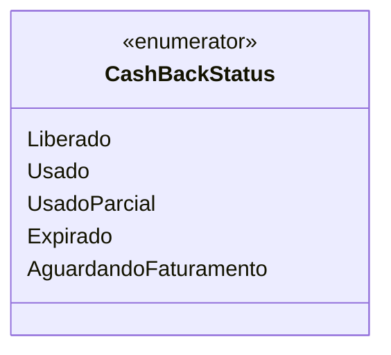

# CashBackStatus
**Namespace**: IsthmusWinthor.Dominio.Enumeradores  
**Nome do Arquivo**: CashBackStatus.cs  

O `CashBackStatus` é um enumerador que define os diferentes estados de um cashback dentro do sistema. Este recurso é importante para a integração com processos de faturamento e gerenciamento de benefícios, permitindo que o sistema saiba como deve tratar cada instância de cashback em relação ao seu ciclo de vida.

### Tipos Auxiliares e Dependências
- Nenhum enumerador ou classe auxiliar adicional foi utilizado.

### Diagrama de Relacionamentos

Nesta representação, o `CashBackStatus` é um enumerador que contém várias constantes que indicam o estado do cashback. É utilizado para garantir que o sistema tenha sempre um controle claro e específico sobre o status do cashback em questão.
